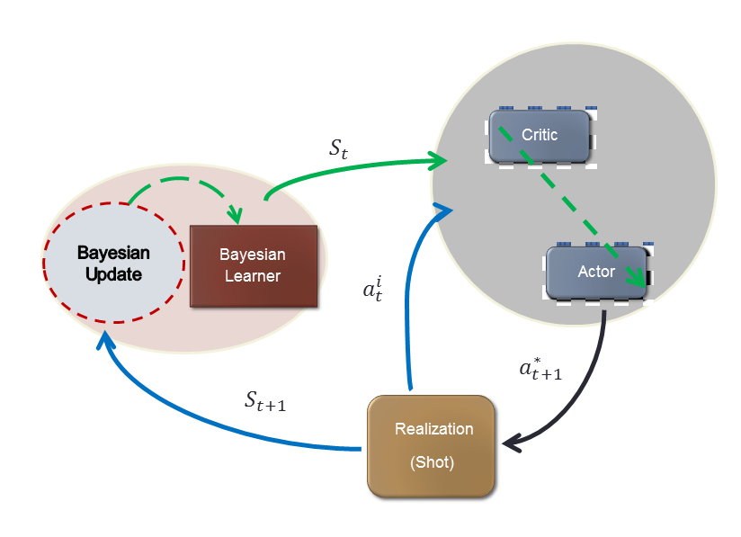
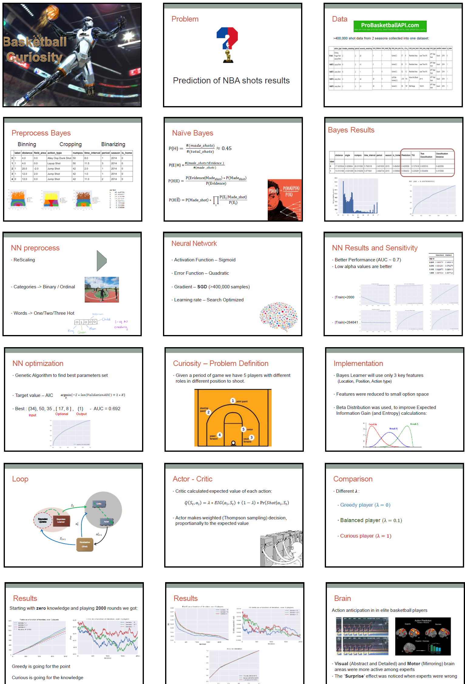

# Artificial Curiosity
## Adaptive Reinforcement Learning of curious AI basketball agents

A machine learning project of learning NBA shots success ratio based on  410,000 records of [NBA players shots stats](http://stats.nba.com).

The project implements various ML techniques in order to create a "Curious" AI agent, which learns success ratios and implements the knowledge in [**exploration-exploitaition**](http://www.indigosim.com/tutorials/exploration/t0s1.htm) game simulation enviroment.

## Part 1 - [Bayesian Inference and Information Gain](part1-bayes/cur_project_bayes.ipynb)
After an [EDA](https://en.wikipedia.org/wiki/Exploratory_data_analysis) stage and preprocessing of shots data into categorical features we implemented a [bayesian inference](https://en.wikipedia.org/wiki/Bayesian_inference) algorithm and evaluated the feature selection with Expected [Information Gain](https://en.wikipedia.org/wiki/Information_gain_ratio) criteria.

## Part 2 - [Neural Network Learning and Optimization](Part2-NN/cur_neural.ipynb)

Manual Neural Network implementation with numpy and SGD method. This part required new preprocess methods (to continuous features) and network structure optimization by improving [prediction AUC](https://en.wikipedia.org/wiki/Receiver_operating_characteristic#Area_under_the_curve) to 70%.

### Extra:
  - [Genetic algorithm optimization](Part2-NN/Genetic.ipynb)
  
    Implementation of a genetic algorithm for network structure optimization.
    
  - [Random Forest, SVM and PCA methods](Part2-NN/Other_models.ipynb)
  
    Benchmarks methods for accuracy estimation and feature selection.

## Part 3 - [Curiosity Loop with Adaptive Reinforcement Learning](/Part3-RL/Artificial_Curiosity_Loop.ipynb)
Implementaion of a Curosity Loop, using [Actor-Critic Method](https://cs.wmich.edu/~trenary/files/cs5300/RLBook/node66.html) and Bayesian Inference.

### The Curiosity Loop:

A "new-born" AI agent takes shots from different positions and learns the success of each shot, while trying to both learn the environment and score as much as possible.

## Project Presentation:
[Link to project presentation (pdf)](Pres.pdf)

## More Links:

- [Big Data Lab @ TAU](http://bigdatalab.tau.ac.il/research/)
- [Curiosity Lab @ TAU](http://gorengordon.wixsite.com/gorengordon)

